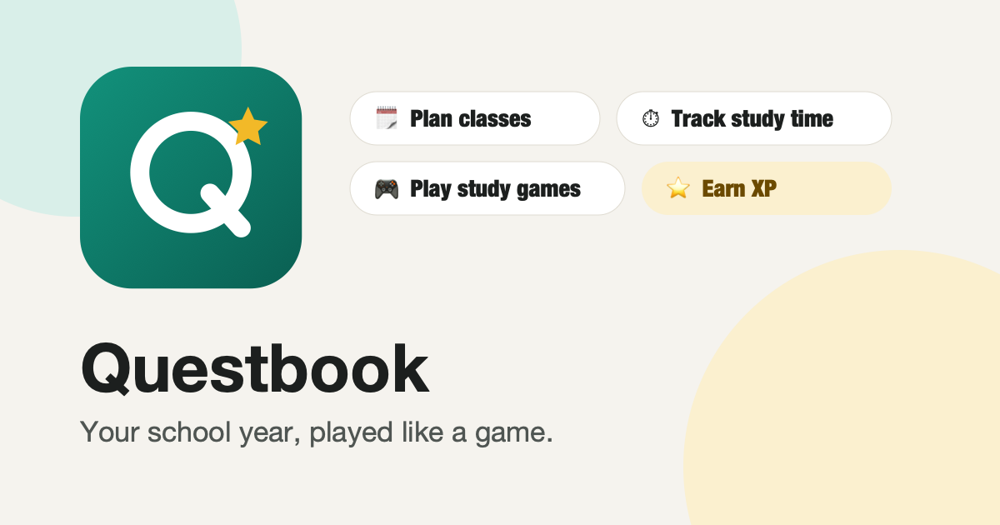

# Questbook

A gamified school planner that keeps classes, schedules, assignments, key dates, study time, notes and study games in one place. It's free and private, needs no account, and can be installed on phones and computers.

**▶ Use it: https://msherman16.github.io/questbook/**



## Docs

| For | Read |
| --- | --- |
| Students and teachers: setup, features, installing, backups | [docs/USER_GUIDE.md](docs/USER_GUIDE.md) |
| Maintainers: run locally, ship updates, other hosts, privacy | [docs/DEPLOYMENT.md](docs/DEPLOYMENT.md) |
| Designers: tokens, components, voice | [DESIGN_SYSTEM.md](DESIGN_SYSTEM.md) |

## Run it locally

```bash
node serve.js
```

Then open http://localhost:5173. You need a local server because the app uses ES modules, which browsers won't load from `file://`. It has no dependencies and no build step.

New visitors see a **setup wizard** that covers their profile, classes and study preferences, followed by a **Getting Started** checklist on Home. The wizard also has an **Explore with demo data** option that loads a sample semester.

## Features

| Area | What it does |
| --- | --- |
| **Home** | Level, streak, focus minutes, what's due soon, daily quests, today's classes and key-date countdowns |
| **Classes & Subjects** | Each class gets a color, icon, teacher, room and weekly meeting times. The color and icon follow the class everywhere. |
| **Schedule** | Week timetable built from your meeting times. Shows what's due each day and a "now" line. |
| **Assignments & Dates** | Homework, quizzes, tests, projects, study blocks and key dates, in a list or month calendar. **Prep plan** adds spaced-review sessions before a quiz or test. |
| **Study Timer** | Pomodoro focus and break timer, tracked by class and technique. Shows 7-day and per-class charts and lets you log time by hand. |
| **Notes Library** | Upload files by drag and drop (PDF, images, docs and so on) or write notes from templates (Cornell, Feynman, Blurt, Summary). Filter by class, tag and search, with an in-app preview. |
| **Study Games** | Flashcards (Leitner spaced repetition), Quiz Show (multiple choice), Match Rush (timed pairs) and Speed Recall (60-second typing). You can mix all decks together to practice interleaving. |
| **Techniques** | Pomodoro, active recall, spaced repetition, practice testing, interleaving, Feynman, blurting and dual coding. Each one links to the tool that does it. |
| **Progress & Badges** | XP, 10 level titles, 12 badges, a 16-week activity heatmap and XP history |
| **Design System** | A live style guide made from the real tokens and components (see `DESIGN_SYSTEM.md`) |
| **Settings** | Theme, text size, reduced motion, timer lengths and sound, JSON backup export and import |

### How XP works

- Finishing work earns XP: homework +20, quiz +30, test +50, project +60, study block +15, key date +10. Finishing 2 or more days early adds +10.
- Each focused minute earns +2.
- Each flashcard you recall earns +2, and each game earns +10 to +60.
- Each note you add earns +10, for up to 5 notes a day.
- Each of the 3 daily quests earns +20 to +30.
- Reopening a task or deleting a study session takes back the XP it earned, so XP can't be farmed.

## Data & privacy

Everything stays on the device and nothing is sent to a server.

- Structured data (classes, tasks, decks, sessions, XP) is saved in `localStorage` under `questbook:v1`.
- Uploaded files are saved in IndexedDB (`questbook-files`).
- Backups you export include everything except uploaded files.

## Project layout

```
index.html
manifest.webmanifest     install-as-app metadata
sw.js                    offline cache (bump VERSION every release)
serve.js                 zero-dependency static server
icons/                   app icons and social preview image
docs/                    user guide and deployment guide
styles/
  tokens.css             design tokens (light and dark themes, text size, motion)
  base.css               reset, typography, app shell
  components.css         buttons, inputs, chips, cards, modals, toasts…
  views.css              screen layouts
js/
  app.js                 shell, router, timer ticker, notifications
  store.js               state, persistence, XP, levels, badges, quests, demo data
  files.js               IndexedDB file storage
  ui.js                  icons, modal, toast, confetti, chime
  components.js          shared task rows and the assignment form
  util.js                dates, formatting, fuzzy answer matching
  views/*.js             one module per screen, each exporting { title, render(state), mount(el) }
```

## Next steps if this becomes a product

- **Accounts and sync.** Move `store.js` persistence to a backend such as Supabase or Firebase so data follows the student across devices. Uploaded files would go to object storage.
- **Mobile app.** The views are plain render and mount modules, so they port cleanly to React Native or Expo, and the tokens map directly onto a theme object.
- **Calendar import.** Read the school's `.ics` feed to fill in classes and key dates.
- **Teacher and parent views.** Shared classes, assignment pushes and read-only progress.
- **AI study help.** Generate flashcards from an uploaded note, or quiz questions from a chapter.
